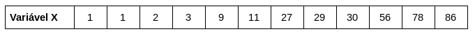
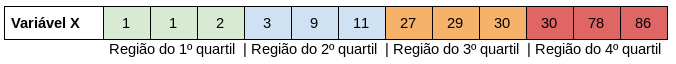
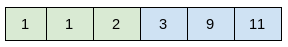
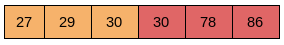

###  1. Introdução

Em estatística descritiva, separatrizes são utilizadas para nos trazer uma visão sobre concentrações de valores para uma dada variável ordenada - ou seja, são úteis sempre que você precisar olhar para um vetor de valores ordenados e deseja descobrir em qual região deste vetor está a maior concentração.

Existem diferentes formas simétricas de dividir um conjunto ordenado em separatrizes. As mais comuns são os quartís e os decís que, como os nomes já sugerem, dividem o conjunto em quatro e dez partes iguais. Nos limitaremos apenas ao caso dos quartís, porém a lógica por trás de outros casos é a mesma (como os centís, que consiste em dividir o conjunto em cem partes).

### 2. Racional

O valor de uma separatriz é o valor de corte que divide uma região em partes simétricas, isso significa que todas as ocorrências dessa variável cujo o valor está abaixo deste valor de corte estão contidas na região compreendida por esta separatriz. Isso parece ser bem confuso, então vamos a um exemplo para tentar deixar as coisas mais claras!

Vamos considerar este exemplo: 12 ocorrências de uma variável descritiva X.



Caso desejássemos estudar as regiões que apresentam maior concentração de valores assumidos por xi, podemos dividir este conjunto em *quartís* da seguinte maneira



Agora que separamos as regiões, vamos calcular os valores de Q1, Q2, Q3 e Q4, que são os valores que limitam cada quartil. 

O valor mais simples de se definir é, de cara, o valor do 4º quartil, pois este corresponde ao valor máximo que esta variável assume. Logo **Q4 = max(x) = 86**.

O valor que limita o segundo quartil corresponde à mediana do conjunto. Se **x** possuir um número ímpar de elemento, a mediana é o valor no centro do conjunto ordenado, caso possua um número par de elementos, é a média entre os dois valores centrais. Neste caso, trata-se de uma variável ordenada com um número par de elementos. Logo, o valor de **Q2** será dado por **(11 + 27)/2 = 19**. Assim, o valor que corta o conjunto ao meio será **Q2 = 19**.

Para os dois quartís restantes, os valores que dividem este conjunto possuem um racional análogo ao cálculo da mediana. Vamos verificar o primeiro caso:



O valor exato que divide os dois primeiros quartis será a média entre os dois elementos centrais. Logo **Q1 = (2 + 3)/2 = 2,5**.

No caso do terceiro quartil:




**Q1 = (30 + 30)/2 = 30**

Com essa análise, conseguimos extrair as seguintes informações

<table>
 <thead>
  <tr>
   <th style="text-align:left;"> Quartil </th>
   <th style="text-align:right;"> Descrição </th>
   <th style="text-align:right;"> Valor </th>
  </tr>
 </thead>
<tbody>
  <tr>
   <th style="text-align:left;"> Q1 </th>
   <th style="text-align:right;"> 25% dos valores assumidos por X encontram-se abaixo deste número </th>
   <th style="text-align:right;"> 2,5 </th>
  </tr>
 <tr>
   <th style="text-align:left;"> Q2 </th>
   <th style="text-align:right;"> 50% dos valores assumidos por X encontram-se abaixo deste número (Corresponde à mediana de X) </th>
   <th style="text-align:right;"> 19 </th>
 </tr>
   <tr>
   <th style="text-align:left;"> Q3 </th>
   <th style="text-align:right;"> 75% dos valores assumidos por X encontram-se abaixo deste número
 </th>
   <th style="text-align:right;"> 30 </th>
 </tr>
 <tr>
   <th style="text-align:left;"> Q4 </th>
   <th style="text-align:right;"> 100% dos valores assumidos por X encontram-se abaixo deste número (corresponde ao maior valor de X) </th>
   <th style="text-align:right;"> 86 </th>
 </tr>
</tbody>
</table>


Ou seja, fica evidente que, apesar da variável assumir um valor máximo de 86, a concentração de valores está localizada abaixo do valor 30 (que corta em 75% a amostra total) e que 50% das ocorrências desta variável encontram-se abaixo de 19.

**Ok, mas porque isso pode ser útil?**

Existem diversas aplicações deste método. A grosso modo, sempre que precisamos entender por quais valores há uma maior concentração de ocorrências de uma variável. Mas vamos pensar de uma forma menos técnica. 


Imagine a necessidade de criar um modelo de Scores. Ou seja, imagine que você quer atribuir notas aos e-mails que vão para sua caixa de spans, para averiguar se estes são realmente spans ou apenas falsos positivos de seu serviço de e-mail (que podem custar uma entrevista de emprego desperdiçada, caso você não perceba que um email esperado acabou por cair no filtro de spams por engano).

Vamos supor que você criou um identificador de palavras que, baseado na ocorrência de algumas palavras específicas, você atribui uma “nota”, de 0 à 100, que corresponde à probabilidade deste e-mail ser, de fato, um span. 

Você deseja encontrar um valor razoável para esta nota em que qualquer valor acima dela o email continue na sua caixa de spam, mas caso esse score esteja abaixo desta nota, este email seja movido de volta para sua caixa de entrada. A única informação que você dispõe é do seu histórico de emails e as notas que seu novo modelo calculou para eles. 

**Resumo do caso: você precisa saber para quais valores a distribuição de notas atribuídas aos seus emails está concentrada.**

 Com o exemplo de quartis, supondo que as notas atribuídas aos seus emails sejam as mostradas na variável X acima.


Se você aproximadamente 30% dos seus emails que são classificados como spams trata-se de falsos positivos, você poderá ajustar seu novo filtro para que os emails que possuam score abaixo do valor do primeiro quartil (Q1) sejam automaticamente movidos à sua caixa de entrada. Ou ainda determinar que email que apresentem nota acima do terceiro quartil sejam excluídos automaticamente. 

### Aplicaçes em R

Para a utilização de qualquer separatriz, existe o comando **quantile** presentes nos pacotes base do R. O uso deste comando é extremamente simples e leva como parâmetros o objeto que contém seus dados e a probabilidade desejada, que deve corresponder com a da separatriz em questão. Mais detalhes deste comando podem ser acessados [na própria documentação do R](https://www.rdocumentation.org/packages/stats/versions/3.4.3/topics/quantile)

Vamos ver um exemplo de como utiliza-lo:

``` R
# Como exemplo, vou criar a variável x com 1000 entradas
# uniformemente distribuídas com valores entre 0 e 1100
x <- runif(n = 1000, min = 0, max = 100)

# Visualizando detalhes desta variável
summary(x)

```

 ```   
 # Output:
 Min.  1st Qu.   Median     Mean  3rd Qu.     Max. 
 0.01091 23.09801 49.69949 49.40474 75.06433 99.72996 
 ```
 
``` R
# Separando em quartis com a função 'quantile'
q1 <- quantile(x, probs = 0.25) # 1º quartil, 25%
q2 <- quantile(x, probs = 0.50) # 2º quartil, 50%
q3 <- quantile(x, probs = 0.75) # 3º quartil, 75%
q4 <- quantile(x, probs = 1.00) # 4º quartil, 100%
```
Os valores obtidos para cada quartil conferem com os valores obtidos na função ``` summary(x) ```:
``` R
data.frame(valor = c(q1, q2, q3, q4))
```
```
# Output:
        valor
25%  23.09801
50%  49.69949
75%  75.06433
100% 99.72996
```
Obtendo, assim, os valores para cada quartil. É importante observar que essas informações são exatamente as mesmas que o comando ```summary(x)``` pode fornecer, uma vez que o objetivo deste é justamente exibir, de forma resumida, como a variável encontra-se distribuída.

Para utilizar otras separatrizes, basta mudar no comando ```quantile``` o parâmetro ```probs```, que corresponde à probabilidade da separatriz em questão. Por exemplo, se quizéssemos calcular o valor do terceiro decil, utilizariamos ``` quantile(x, probs = 0.30) ```.

